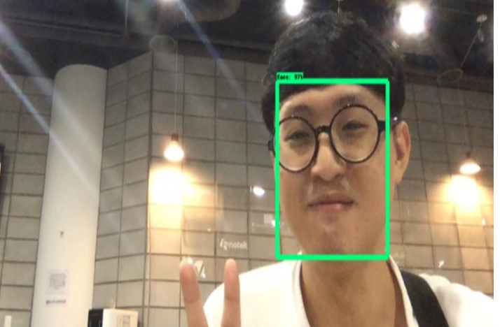
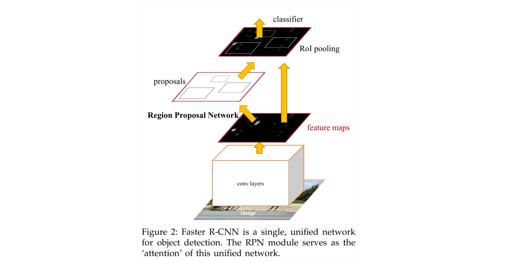
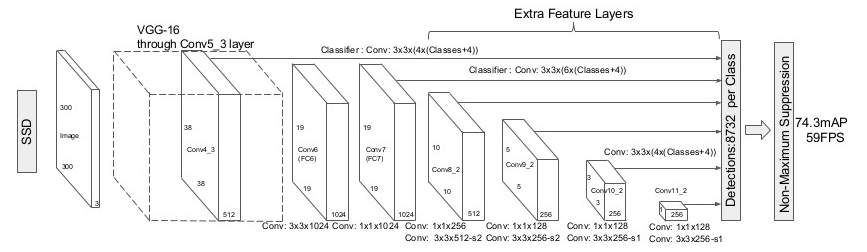
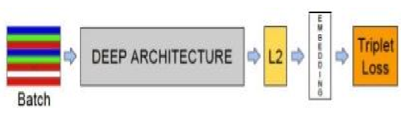
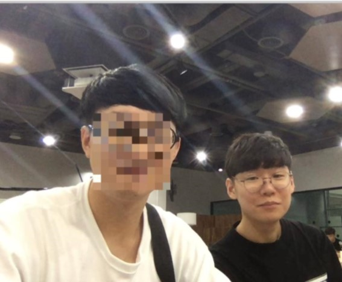
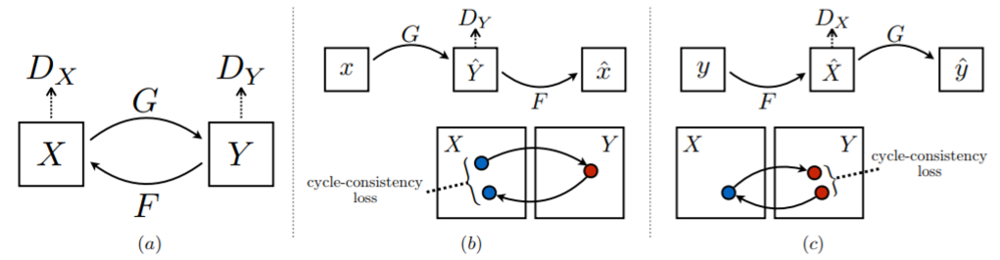
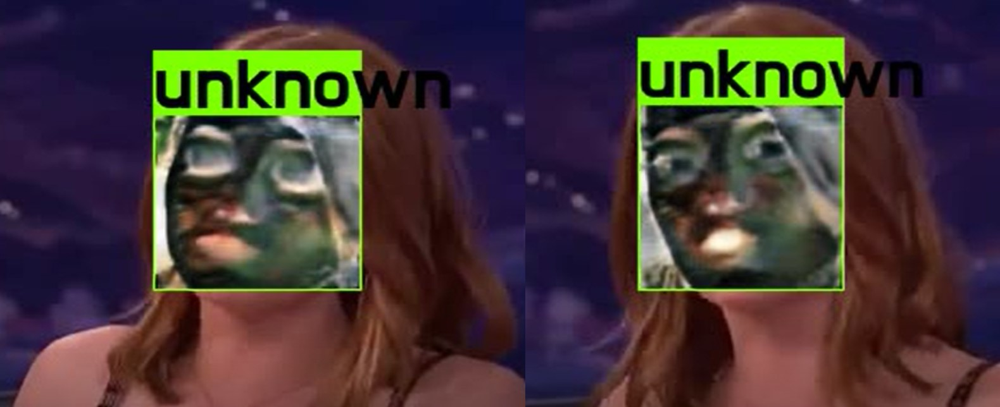
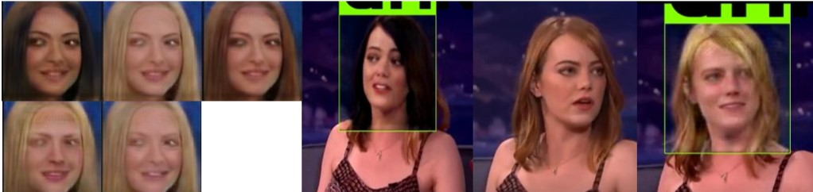
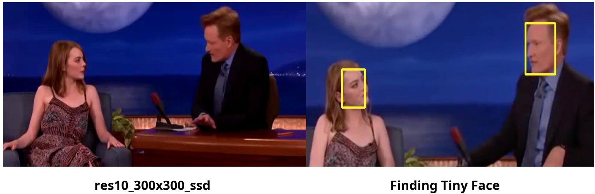
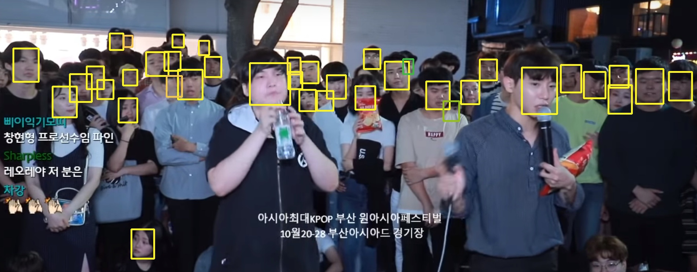

# Eol GAN i(얼 GAN 이 프로젝트)

## Team member

- [김보균](https://github.com/k4771kim)
- [오영택](https://github.com/ohyoungtack)
- [이선미](https://github.com/SunmaiLee)
- [이명훈](https://github.com/MH-Lee)
- [최진호](https://github.com/dostrct)

### 1. 프로젝트 소개

- 최근 1 인 방송 스트리밍 서비스로 인해 사람들의 초상권 침해에 대한 문제가 제기
  되고 있음
- 얼간이 프로젝트는 이러한 문제점을 AI 기술로 해결하고자 함

### 2.프로젝트 구성

- face detection

`faster RCNN` `SSD` `Finding Tiny Face`를 통한 얼굴 detecting 을 시도하였다.

</br>
<p align="center"></img></br>Faster RCNN을 이용한 detecting</p>

</br>
<p align="center"></img></br>Faster RCNN</p>

`Faster RCNN` 은 `Fast RCNN`의 속도 문제를 GPU 를 이용한 RPN 으로 극복하여 실시
간 처리에 가까워졌다. 하지만 실시간으로 스트리밍 되는 이미지를 처리하기에는 여전
히 속도의 문제가 존재하였다.

속도 문제가 조금 개선된 `SSD (single short detector)`를 사용하여 중간 평가까지
real time 서비스를 구축 </br>

<p align="center"></img></br>SSD</p>
 
 + Face Recognition

</br>
<p align="center"></img></br></p>

`Face Net`은 `CNN`을 통해 Embedding 된 Loss 를 기준이되는 Anchor 와 비교하여서
positive 와 negative 로 구분

</br>
<p align="center"></img></br></p>

- GAN

모자이크 외에 좀더 자연스럽게 영상을 처리하기 위해서 GAN 을 사용

`Cycle GAN`

</br>
<p align="center"></img></br></p>

`Cycle GAN`에서 웹에서 크롤링을 하여 얼굴에 위장크림을 바른 데이터를 수집 학습
</br>

<p align="center"></img></br></p>

영상에서 인식되지 않는 사용자를 Cycle GAN 을 이용해 위장크림을 바른 것 같은 효과
를 주어서 초상권 침해를 방지

##### 코드 사용법

data 폴더에 그 안에 편집할 영상을 넣고 test

```python
python main.py
```

`Star GAN`

<p align="center"></img></br></p>

Star GAN 을 이용하여 사후 편집 시에 지정한 대상의 얼굴을(성별, 헤어스타일) 변화
시킬 수 있다.

[star GAN github](https://github.com/MH-Lee/stargan_project05)

data 폴더를 만들고 그 안에 편집할 영상을 집어넣는데

```python
python main2.py
```

####4.구현하지 못한 부분

<p align="center"></img></br></p>

<p align="center"></img></br></p>

- ssd resnet 에서는 옆 모습과 작은 얼굴에 대한 detecting 이 잘 되지 않아서 이를
  finding tiny face 를 통해서 해결하고자 하였다. 하지만 이를 face net 과 합치는
  것에 실패

- finding tiny face 를 face net 에 embed 한다면 작은 얼굴에 대한 처리도 강화할수
  있음

####5. 참고자료 [Faster RCNN 논문](https://arxiv.org/abs/1506.01497)
[Faster RCNN Github](https://github.com/rbgirshick/py-faster-rcnn)
[Faster RCNN Github2](https://github.com/tensorflow/models)
[face net 논문](https://arxiv.org/abs/1503.03832)
[Face net Github](https://github.com/davidsandberg/facenet)
[Finding Tiny Face](https://arxiv.org/abs/1703.10593)
[Finding Tiny Face](https://arxiv.org/abs/1703.10593)
[GAN 논문 1](https://arxiv.org/abs/1711.09020)
[GAN 논문 2](https://arxiv.org/abs/1703.10593)
[Star GAN](https://github.com/yunjey/StarGAN)
